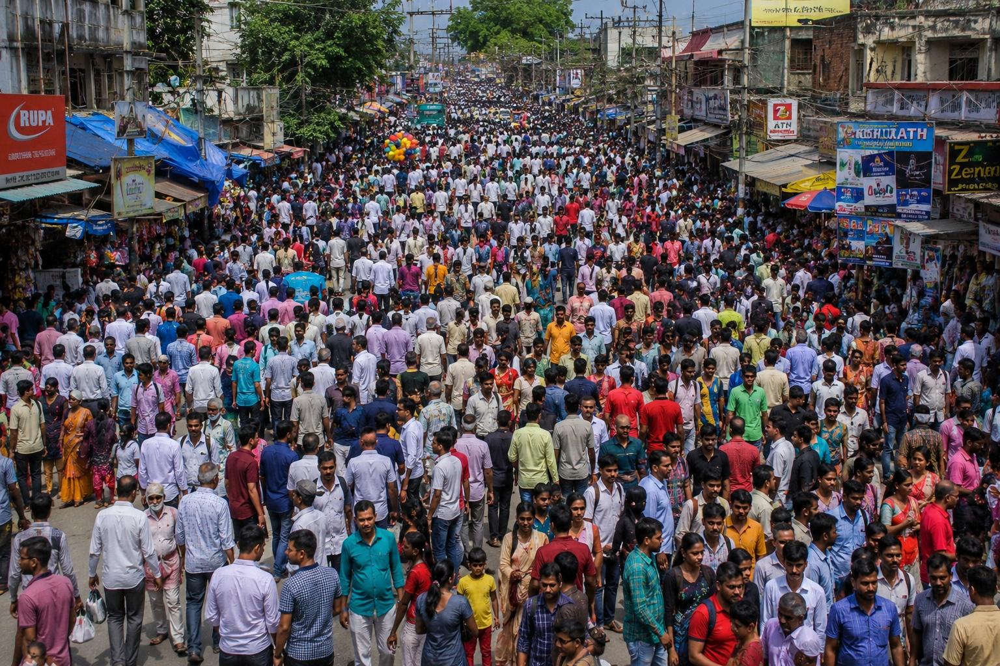
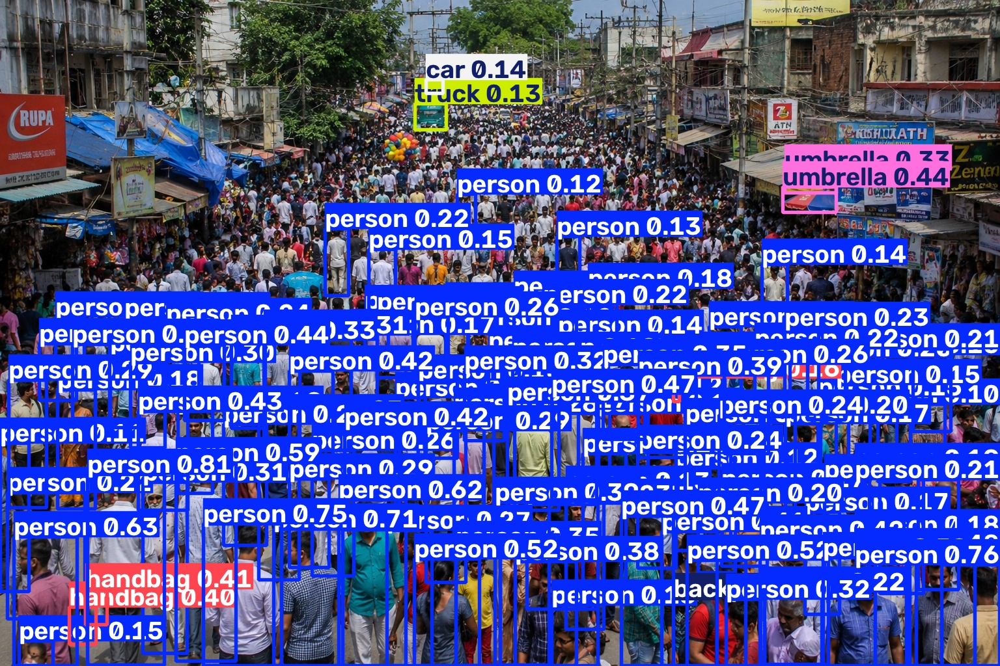
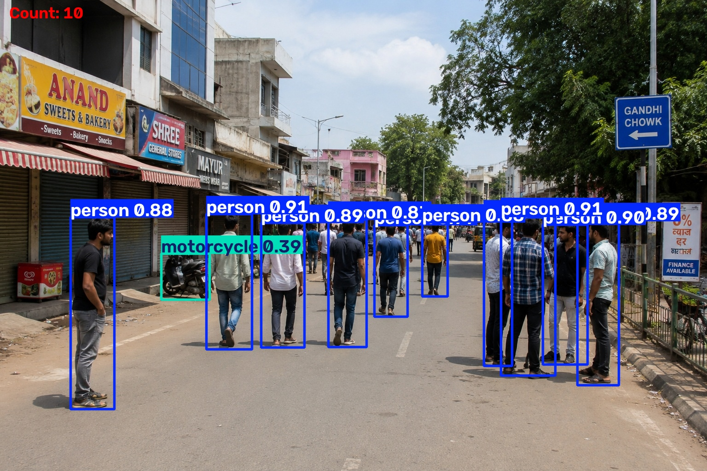

# Crowd Control System using YOLO and SAHI

## Overview
This project detects and counts people in crowded scenes using YOLO and SAHI (Slicing Aided Hyper Inference). The system improves detection accuracy in dense crowd images by dividing large images into smaller slices before inference.

## Features
- Person detection using YOLO
- Crowd counting
- SAHI sliced inference
- Annotated output images
- Crowd analysis from images

## Technologies Used
- Python
- YOLO
- SAHI
- OpenCV
- Pandas
- NumPy

## Project Structure

- crowd_control.ipynb
- test.py
- sample images
- output images

## Results

The system successfully detects and counts people in crowded scenes using YOLO and SAHI.

Example outputs include:

- Original crowd image
- Detected people image
- Crowd count visualization
- Crowd analysis results stored in CSV format

## Sample Output

### Input Image

### Detection Result

### Crowd Count Result

## Future Improvements
- Real-time video processing
- CCTV integration
- Streamlit web application
- Crowd density alerts

## Notes

This repository contains the source code, notebook, sample images, and requirements file.

YOLO model weight files (.pt) are excluded from version control and must be downloaded separately before running the project.

### Run the Project

pip install -r requirements.txt

streamlit run app.py
